# Syntax Tree & Parser

Official site: [Link](https://rust-analyzer.github.io/book/contributing/syntax.html).

Commit link: [2020-01-09](https://github.com/rust-lang/rust-analyzer/tree/cf5bdf464cad7ceb9a67e07985a3f4d3799ec0b6)

## Architectural Overview

- The system has three isolated components:
  - [`rowan`](https://github.com/rust-analyzer/rowan/tree/v0.15.10): A generic, language-agnostic library for immutable syntax trees using the Red-Green tree model.
  - [`syntax` (crate)](https://github.com/rust-lang/rust-analyzer/tree/cf5bdf464cad7ceb9a67e07985a3f4d3799ec0b6/crates/ra_syntax): Wrap `rowan` with a `rust-analyzer`-specific API. It's the only crate that knows about `rowan`.
  - [`parser` (crate)](https://github.com/rust-lang/rust-analyzer/tree/cf5bdf464cad7ceb9a67e07985a3f4d3799ec0b6/crates/ra_parser): Output events from parsing without knowing anything about the tree structure.

## Design Goals

- Lossless: Everything is preserved—whitespace, comments, even invalid tokens.
- Semantic-less: Pure structure with no type checking or name resolution.
- Context-free: Trees are simple values that don't depend on external context.
- Resilient: Always produce a tree, even from broken code (nodes may be partial).
- Performance: Optimized for memory and CPU using `unsafe` where needed.
- Decoupled: Parser and tree evolve independently.
- Intuitive traversal: Easy navigation between parent, children, and siblings.

## The Three-Layer Syntax Tree

The core idea is a "Red-Green Tree" (borrowed from Roslyn), where three layers balance memory usage against API convenience.

- _Semi-transient_: Trees don't live in memory permanently—they get lowered to a compact form but can be rebuilt when needed.

### Layer 1: GreenNode (The Storage)

- GreenNode is where the actual data lives—it's purely functional, immutable, and persistent with arbitrary arity.
- Conceptual (unoptimized) example from `rust-analyzer`:

  ```rust
  // Runtime tag for a Node/Token
  // Nodes and tokens both use the same tag kind?
  #[derive(PartialEq, Eq, Clone, Copy)]
  struct SyntaxKind(u16);

  #[derive(PartialEq, Eq, Clone)]
  struct Node {
      kind: SyntaxKind,
      // Only the byte-length is stored, offset is not stored
      text_len: usize,
      // A generic node with a sequence of children nodes and tokens
      // `Arc` is used, so it allows for multithreading
      children: Vec<Arc<Either<Node, Token>>>,
  }

  #[derive(PartialEq, Eq, Clone)]
  struct Token {
      kind: SyntaxKind,
      text: String,
  }
  ```

- A `Token` is a leaf node, while `Node` represents interior nodes.
- Some things to note:
  - There's just one generic node structure—nodes are untyped with a runtime tag.
  - The original text comes from combining all the children's text.
  - Finding a specific child means scanning through siblings linearly.
  - Modifying the tree gets more expensive with height (due to path copying).
  - Invalid input gets wrapped in an `ERROR` node.
  - Errors live separately, not embedded in the tree itself.

The following optimizations are mostly attributed to [CAD97](https://github.com/cad97).

#### Optimizations

```text
[ RefCount | Kind | TextLen | N_Children | Child_1 | Child_2 | ... | Child_N ]
<------------------------- Single Heap Allocation ------------------------->
```

- Dynamically sized type (DST): Everything in one heap allocation instead of splitting the node and its children into separate allocations.
- Tagged pointers: A single pointer where the last bit indicates whether it's a `Node` or `Token` (cheaper than `Arc<Either<Node, Token>>`).
- Interning: Tokens get reused—`1 + 1` only stores one `1` token that's shared. Returns `Arc<Node>` so trees are self-contained.
- `TextSize`: Just a newtyped `u32` for tracking text length.
- `SmolStr`: Small strings like `fn` or `if` live on the stack inline, no heap allocation needed.
  - Note: The text suggests moving this data directly into the interned token allocation in the future.

#### Alternative Designs

##### Dealing With Trivia

- Explicit nodes (Rowan/IntelliJ): Whitespace becomes regular sibling nodes. Lossless and easy to edit, but noisy when traversing.
- Attached trivia (Roslyn/Swift): Whitespace hides inside tokens as "leading/trailing" properties, so the tree only shows logical code.
- Linked list (Dart): A hybrid approach with a clean semantic tree plus a separate doubly-linked list for all tokens.

- There's no standard approach to handling trivia. For reference, `@dbml/parse` uses the attached trivia approach.

| Strategy                                                 | Pros                                                                                                                                                                           | Cons                                                                                                                                                 |
| :------------------------------------------------------- | :----------------------------------------------------------------------------------------------------------------------------------------------------------------------------- | :--------------------------------------------------------------------------------------------------------------------------------------------------- |
| **Explicit Nodes**<br>(Rowan, IntelliJ, `rust-analyzer`) | **Uniformity:** Everything is a node; simple data model.<br>**Fidelity:** Lossless representation of text.<br>**Refactoring:** Moving a branch naturally moves its formatting. | **Noise:** Tree traversal requires manual filtering of whitespace.<br>**Memory:** Higher node count (every space is an object).                      |
| **Attached Trivia**<br>(Roslyn, Swift)                   | **Clarity:** Tree contains _only_ logical code.<br>**Iteration:** Iterating children yields immediate semantic tokens.                                                         | **Complexity:** "Re-stitching" text during refactoring is hard.<br>**Ownership:** Ambiguous whether a comment belongs to the previous or next token. |
| **Linked List**<br>(Dart)                                | **Dual View:** Optimized for both semantic analysis (Tree) and formatting (List).<br>**Scanning:** Linear access to tokens is very fast.                                       | **Syncing:** High maintenance cost to keep the Tree and List in perfect sync.<br>**Overhead:** Requires managing parallel data structures.           |

##### Accessing Children

- Linear can (IntelliJ/Rowan):
  - Children live in a dynamic list with trivia mixed in.
  - You have to scan through siblings (**O(N)**) to find what you want.
  - Very memory efficient—missing nodes cost nothing.
- Fixed slots (Roslyn/Swift):
  - Every possible child gets a fixed slot in the grammar.
  - Direct **O(1)** access by index.
  - Uses more memory since it allocates slots even for `None` values.
  - Trivia has to be removed to keep indices stable.

| Feature           | Linear Scan (IntelliJ)                 | Fixed Slots (Roslyn/Swift)              |
| :---------------- | :------------------------------------- | :-------------------------------------- |
| **Access Speed**  | **O(N)** (Must iterate/skip)           | **O(1)** (Direct Index)                 |
| **Memory Usage**  | **Compact** (Only stores present data) | **Sparse** (Allocates slots for `None`) |
| **Missing Nodes** | Implicitly absent                      | Explicitly stored as `Option::None`     |
| **Trivia**        | Included as sibling nodes              | Removed or attached to tokens           |

##### Mutable Trees

- Mutable trees (IntelliJ): **Imperative** style.
  - You modify nodes directly in place (`node.delete()`).
  - Simple API but thread-safety gets complicated (need read/write locks).
- Immutable trees (`rust-analyzer`): **Functional** style.
  - You build up changes with a `Builder` then generate a fresh tree.
  - More verbose API, but concurrency becomes trivial (snapshots are naturally safe).

```rust
// MUTABLE (IntelliJ Style)
// Direct, in-place modification. Simple but requires locking.
for bound in bounds {
    // The tree changes immediately
    bound.delete();
}

// IMMUTABLE (rust-analyzer Style)
// Indirect. Must collect edits and rebuild the tree structure.
let mut builder = tree.edit();
for bound in bounds {
    // Schedule deletion on the 'builder', not the node itself
    builder.delete(bound);
}
// Apply generates a completely new root node
let new_tree_root = builder.apply();

```

| Feature          | Mutable Trees (IntelliJ)            | Immutable Trees (`rust-analyzer`)                  |
| :--------------- | :---------------------------------- | :------------------------------------------------- |
| **Editing API**  | **Simple** (Direct `node.delete()`) | **Verbose** (Requires `Builder` / rewriting spine) |
| **Concurrency**  | **Hard** (Needs complex R/W locks)  | **Easy** (Snapshots are thread-safe)               |
| **Mental Model** | "DOM Manipulation"                  | "Version Control" / Persistent Data Structures     |
| **Performance**  | Fast small edits                    | Slower (allocates new nodes for the path to root)  |

### Layer 2: SyntaxNode (The Cursor / RedNode)

- GreenNode has some limitations: no parent pointers (can't go up the tree), and if the same GreenNode appears in multiple places, they're treated as identical.
- SyntaxNode/RedNode (also called cursors or [zippers](<https://en.wikipedia.org/wiki/Zipper_(data_structure)>)) solve this by adding parent pointers and position information.
- Conceptual (unoptimized) example from `rust-analyzer`:

  ```rust
  type SyntaxNode = Arc<SyntaxData>;

  struct SyntaxData {
      offset: usize,
      parent: Option<SyntaxNode>,
      green: Arc<GreenNode>,
  }

  impl SyntaxNode {
      fn new_root(root: Arc<GreenNode>) -> SyntaxNode {
          Arc::new(SyntaxData {
              offset: 0,
              parent: None,
              green: root,
          })
      }
      fn parent(&self) -> Option<SyntaxNode> {
          self.parent.clone()
      }
      fn children(&self) -> impl Iterator<Item = SyntaxNode> {
          let mut offset = self.offset;
          self.green.children().map(|green_child| {
              let child_offset = offset;
              offset += green_child.text_len;
              Arc::new(SyntaxData {
                  offset: child_offset,
                  parent: Some(Arc::clone(self)),
                  green: Arc::clone(green_child),
              })
          })
      }
  }

  impl PartialEq for SyntaxNode {
      fn eq(&self, other: &SyntaxNode) -> bool {
          self.offset == other.offset
              && Arc::ptr_eq(&self.green, &other.green)
      }
  }
  ```

#### Optimizations

- Atomic avoidance: Use `Rc` (non-atomic) instead of `Arc` for parent pointers since traversals are single-threaded anyway, avoiding atomic overhead.
- Thread movement: Can't send `SyntaxNode` across threads directly, so you send lightweight coordinates like `(GreenNode, TextRange)` instead. The receiving thread rebuilds the node from those coordinates.
- Transient trees: Instead of keeping full trees in memory, `rust-analyzer` just stores `(FileId, TextRange)` and reparses when needed—trading CPU time for memory.
- Root-only `Arc`: Only the root holds an `Arc<GreenNode>` as the tree's memory anchor. Descendants use raw pointers (fast) plus an `Rc` to their parent (safe). Since each child's `Rc` keeps its parent alive all the way up to the root, the raw pointers never dangle. This means you only pay for atomic operations once at the root—the rest is just cheap `Rc` bumps.
- Object pooling: Keep a thread-local "free list" of node objects for reuse instead of calling `malloc` constantly. The pool only needs to match traversal depth (not tree size), so a few dozen slots can handle huge trees. This lets you return "owned" nodes cheaply (just a pointer move) which are nicer to work with than references.

#### Alternative Designs

##### Memoized RedNodes

- Memoized nodes (C#/Swift): Heavy `Arc` objects that permanently cache everything—offset, parent, children. You get true pointer equality (super fast comparison) but it doubles memory since the whole tree is duplicated in the "Red" layer. C# tries to claw back memory with weak references.
- Cursor approach (`rust-analyzer`): Lightweight views that calculate positions on demand. Memory scales with traversal depth, not tree size.

```rust
// Memoized Design (C# / Swift)
// Persistent, heavy wrapper around the data.
struct SyntaxData {
    offset: usize,
    parent: Option<SyntaxNode>, // Back-link
    // Caches children forever. High memory cost.
    children: Vec<OnceCell<SyntaxNode>>,
}

```

| Feature           | Memoized Nodes (C#/Swift)    | Cursors (`rust-analyzer`)       |
| :---------------- | :--------------------------- | :------------------------------ |
| **Node Identity** | **Pointer Equality** (Fast)  | **Range Check** (Slower)        |
| **Memory Cost**   | **High** (Doubles tree size) | **Low** (Proportional to depth) |
| **Child Access**  | Cached (Immediate)           | Computed (On-demand)            |
| **Persistence**   | Long-lived Objects           | Transient / Re-created          |

### Layer 3: AST (The API)

- A strongly typed API is way more convenient than working with untyped GreenNodes directly (though untyped works fine for error or trivial nodes).
- For example, having a typed `FnDef` with well-known methods beats a generic node you have to manually inspect.
- Example `AstNode` trait (from `rust-analyzer`):

  ```rust
  pub trait AstNode {
    fn cast(syntax: SyntaxNode) -> Option<Self>
    where
        Self: Sized;

    fn syntax(&self) -> &SyntaxNode;
  }
  ```

- The classes are auto-generated. One example from `rust-analyzer`:

  ```rust
  #[derive(Debug, Clone, PartialEq, Eq, Hash)]
  pub struct FnDef {
      syntax: SyntaxNode,
  }

  impl AstNode for FnDef {
      fn cast(syntax: SyntaxNode) -> Option<Self> {
          match syntax.kind {
              SyntaxKind::FN => Some(FnDef { syntax }),
              _ => None,
          }
      }
      fn syntax(&self) -> &SyntaxNode {
          &self.syntax
      }
  }

  impl FnDef {
      pub fn param_list(&self) -> Option<ParamList> {
          self.syntax.children().find_map(ParamList::cast)
      }
      pub fn ret_type(&self) -> Option<RetType> {
          self.syntax.children().find_map(RetType::cast)
      }
      pub fn body(&self) -> Option<BlockExpr> {
          self.syntax.children().find_map(BlockExpr::cast)
      }
      // ...
  }
  ```

- Variants such as expressions are represented as `enum`s. One example from `rust-analyzer`:

  ```rust
  #[derive(Debug, Clone, PartialEq, Eq, Hash)]
  pub enum AssocItem {
      FnDef(FnDef),
      TypeAliasDef(TypeAliasDef),
      ConstDef(ConstDef),
  }

  impl AstNode for AssocItem {
      ...
  }
  ```

- Shared syntactic elements (like names, loop bodies, or doc comments) are modeled via traits:

  ```rust
  trait HasName: AstNode {
      fn name(&self) -> Option<Name>;
  }

  impl HasName for FnDef {
      fn name(&self) -> Option<Name> {
          self.syntax.children().find_map(Name::cast)
      }
  }
  impl HasName for StructDef {
      fn name(&self) -> Option<Name> {
          self.syntax.children().find_map(Name::cast)
      }
  }
  ```

#### Alternative Designs

##### Semantic Full AST

- IntelliJ's PSI is a "rich" AST that abstracts away where code came from—a `PsiMethod` looks the same whether it's from source (`.java`) or compiled (`.jar`), hiding all that complexity.
- Attached semantics: Nodes have methods like `resolve()` or `getSuperClass()` built in, so you can query semantics directly on the tree.
- Memory optimization: Start as a lightweight "stub" (just serialized metadata) and only inflates to a full AST when you actually open the file.

| Feature     | Pure AST (`rust-analyzer`) | Semantic PSI (IntelliJ)                 |
| :---------- | :------------------------- | :-------------------------------------- |
| **Scope**   | Source code structure only | Source + Compiled Libraries             |
| **Backing** | Always AST                 | **Dynamic** (index stub -> full tree)   |
| **Logic**   | External (analysis passes) | **Internal** (methods on nodes)         |
| **Memory**  | Low (transient cursors)    | High (rich objects), mitigated by stubs |

## Parsing - The Token Sequence Transformer

- You can think of parsing as doing a DFS traversal of the tree you want to build.
- When the parser finishes a node, it calls `GreenNodeBuilder` to construct it:

  ```rust
  pub struct GreenNodeBuilder { ... }

  impl GreenNodeBuilder {
      pub fn new() -> GreenNodeBuilder { ... }

      pub fn token(&mut self, kind: SyntaxKind, text: &str) { ... }

      pub fn start_node(&mut self, kind: SyntaxKind) { ... }
      pub fn finish_node(&mut self) { ... }

      pub fn finish(self) -> GreenNode { ... }
  }
  ```

- There are two kinds of input: source text (full of trivia like whitespace and comments) and macro token trees (just structural tokens, no trivia).
- Input and output tokens don't match 1-to-1. The parser uses abstract callbacks—`TokenSource` for reading input and `TreeSink` for writing output. An intermediary layer handles the mismatches, like stripping whitespace or merging `>` + `>` into `>>`.
- The parser interface (from `rust-analyzer`):

  ```rust
  // Different structure than GreenNode's Token
  pub struct Token {
    pub kind: SyntaxKind,
    pub is_joined_to_next: bool,
  }

  pub trait TokenSource {
      fn current(&self) -> Token;
      fn lookahead_nth(&self, n: usize) -> Token;
      fn is_keyword(&self, kw: &str) -> bool;

      fn bump(&mut self);
  }

  pub trait TreeSink {
      fn token(&mut self, kind: SyntaxKind, n_tokens: u8);

      fn start_node(&mut self, kind: SyntaxKind);
      fn finish_node(&mut self);

      fn error(&mut self, error: ParseError);
  }

  pub fn parse(
      token_source: &mut dyn TokenSource,
      tree_sink: &mut dyn TreeSink,
  ) { ... }
  ```

- The `parser` and `syntax` crates are completely separate with zero dependencies on each other, achieving strict modularity.
- The parser mostly works with `SyntaxKind` tags and ignores the actual text, except for one hack: checking contextual keywords like `union` or `default`.
- `TreeSink` isn't atomic. When the parser emits a logical token like `>>`, the sink can consume multiple raw tokens (`>` and `>`).

### Reporting Syntax Errors

- Errors aren't stored in the tree, they're collected separately in a `Vec<SyntaxError>`.
- This separation means you can build or modify trees manually without worrying about error state.
- The parser is intentionally permissive (like allowing `pub` on trait methods). These "soft" errors get caught later in a validation pass.

### Macros

- Token hygiene: Macros need to remember where tokens came from so variables with the same name from different scopes don't get confused. While building the tree, `TreeSink` also creates a map linking text ranges back to their original token IDs. So parsing gives you two things: the tree and a map tracing everything back to its source.
- Operator precedence: To avoid breaking precedence (like `$expr * 1` messing up order of operations), the parser adds invisible parentheses around macro expansions.

### Whitespace & Comments

- The core parser works with a "clean" token stream—no whitespace or comments to worry about.
- But trivia isn't thrown away. The `TreeSink` layer re-inserts it into the final tree as nodes get built.
- Comments don't just get dumped linearly—they're attached heuristically to their semantic parents. Like a comment right before a function becomes a child of that `FnDef` node.

### Incremental Reparse

- Green trees make modifications cheap—you can "patch" by swapping a single node pointer with a freshly parsed subtree. No external state needed.
- Block heuristic: Edits get isolated to the smallest `{}` block that contains them. This works because the parser keeps braces balanced even in broken code, giving you stable anchor points.

<details>
<summary><strong>Q&A: How does the parser maintain balanced braces in broken code?</strong></summary>

**Q: How can braces be "balanced" when users type unmatched `{` or `}`?**

A: The **tree structure** maintains balanced braces, not the source text. The parser uses error recovery to ensure every `start_node(BLOCK)` has a matching `finish_node()`.

**Q: What happens when a closing brace is missing?**

A: The parser inserts an **implicit/phantom closing brace**. For example:

```rust
fn foo() {
    let x = 1;
// EOF - missing }
```

The tree structure acts as if the `}` exists at EOF, even though it's not in the source text. This is implemented in the parser's [block parsing logic](https://github.com/rust-lang/rust-analyzer/blob/cf5bdf464cad7ceb9a67e07985a3f4d3799ec0b6/crates/ra_parser/src/grammar/expressions/atom.rs#L476-L481), which automatically closes unclosed blocks at EOF or when encountering incompatible tokens.

**Q: What if there's an unexpected token inside a block?**

A: The parser uses **early block termination**. For example:

```rust
fn foo() {
    let x = 1;
fn bar() {  // unexpected fn - shouldn't be here
```

The parser:

- Realizes `fn` shouldn't be inside `foo`'s block
- Inserts an implicit `}` to close `foo`
- Continues parsing `bar` at the outer level
- Wraps the malformed content in an `ERROR` node

This is part of the "panic mode" error recovery strategy implemented in the [event-based parser](https://github.com/rust-lang/rust-analyzer/blob/cf5bdf464cad7ceb9a67e07985a3f4d3799ec0b6/crates/ra_parser/src/event.rs#L21-L129).

**Q: What about extra closing braces?**

A: Unmatched `}` tokens are:

```rust
fn foo() {
}
}  // extra closing brace
```

- Treated as error tokens
- Wrapped in an `ERROR` node
- Not matched with anything
- The structural tree still has balanced blocks

**Q: How does this enable the block heuristic?**

A: Because braces are always structurally balanced, the parser can reliably:

- Find the smallest enclosing `{}` block around any edit
- Use these blocks as stable anchor points
- Reparse just that subtree instead of the entire file

This is implemented in the [incremental reparsing logic](https://github.com/rust-lang/rust-analyzer/blob/cf5bdf464cad7ceb9a67e07985a3f4d3799ec0b6/crates/ra_syntax/src/parsing/reparsing.rs#L24-L148) in the `syntax` crate, particularly the `incremental_reparse` function and `is_balanced` check.

</details>

- In practice though, incremental reparsing often isn't worth it. Modern parsers are fast enough to just reparse the whole file from scratch.

## Parsing Algorithm

- Recursive descent: Each grammar rule maps to a function that calls other functions recursively to parse sub-expressions. This makes the parser easy to understand and debug.
- Pratt parsing: Handle operator precedence elegantly without building complex precedence tables. Used specifically for expressions with binary operators.
- Error recovery: The parser makes a special effort to continue parsing even when it encounters syntax errors. Instead of stopping at the first error, it attempts to recover and continue building the tree, marking problematic sections with `ERROR` nodes.

### Parser Recap

The parser's design achieves strict modularity through well-defined interfaces:
- `TokenSource` trait:
  - Define how the parser reads input tokens.
  - The parser doesn't know or care whether tokens come from source text (with trivia), macro expansions (without trivia), or any other source.
- `TreeSink` trait:
  - Define how the parser writes output events (`start_node`, `finish_node`, `token`, `error`).
  - The parser has no knowledge of how these events are converted into the final tree structure.

## Interaction Between The `syntax` and The `parser` Crate

The `parser` and `syntax` crates have **zero dependencies** on each other. Both crates depend on shared interfaces (traits), but neither depends on the other's implementation.

```mermaid
%%{init: {'theme':'neutral', 'themeVariables': {'fontSize':'16px'}}}%%
flowchart LR
    A(["<i>string</i><br/><b>Source Text</b>"])

    subgraph top["<code>syntax</code> crate"]
        direction LR
        B["<i>fn</i><br/><b>tokenize</b>"]
        C(["<i>Vec&lt;Token&gt;</i><br/><b>Token Stream</b>"])
        B --> C
    end

    subgraph P["<code>parser</code> crate"]
        direction LR
        D{{"<i>trait</i><br/><b>TokenSource</b>"}}
        E["<i>fn</i><br/><b>parse</b>"]
        F{{"<i>trait</i><br/><b>TreeSink</b>"}}
        D --> E --> F
    end

    subgraph bottom["<code>syntax</code> crate"]
        direction RL
        I{{"<i>trait</i><br/><b>AstNode</b>"}}
        H(["<i>type</i><br/><b>SyntaxNode</b>"])
        G(["<i>type</i><br/><b>GreenNode</b>"])
        G --> H --> I
    end

    A --> B
    C -.->|implements| D
    F -.->|implemented by| G

    click B "https://github.com/rust-lang/rust-analyzer/blob/cf5bdf464cad7ceb9a67e07985a3f4d3799ec0b6/crates/ra_syntax/src/parsing/lexer.rs#L30-L92" "View tokenize function"
    click C "https://github.com/rust-lang/rust-analyzer/blob/cf5bdf464cad7ceb9a67e07985a3f4d3799ec0b6/crates/ra_syntax/src/parsing/lexer.rs#L9-L15" "View Token struct"
    click D "https://github.com/rust-lang/rust-analyzer/blob/cf5bdf464cad7ceb9a67e07985a3f4d3799ec0b6/crates/ra_parser/src/lib.rs#L30-L44" "View TokenSource trait"
    click E "https://github.com/rust-lang/rust-analyzer/blob/cf5bdf464cad7ceb9a67e07985a3f4d3799ec0b6/crates/ra_parser/src/lib.rs#L81-L84" "View parse function"
    click F "https://github.com/rust-lang/rust-analyzer/blob/cf5bdf464cad7ceb9a67e07985a3f4d3799ec0b6/crates/ra_parser/src/lib.rs#L56-L69" "View TreeSink trait"
    click G "https://github.com/rust-lang/rust-analyzer/blob/cf5bdf464cad7ceb9a67e07985a3f4d3799ec0b6/crates/ra_syntax/src/syntax_node.rs#L10-L10" "View GreenNode type"
    click H "https://github.com/rust-lang/rust-analyzer/blob/cf5bdf464cad7ceb9a67e07985a3f4d3799ec0b6/crates/ra_syntax/src/syntax_node.rs#L33-L34" "View SyntaxNode type alias"
    click I "https://github.com/rust-lang/rust-analyzer/blob/cf5bdf464cad7ceb9a67e07985a3f4d3799ec0b6/crates/ra_syntax/src/ast.rs#L31-L42" "View AstNode trait"

    classDef syntaxNode fill:#dbeafe,stroke:#3b82f6,stroke-width:2px,color:#1e40af
    classDef parserNode fill:#fed7aa,stroke:#f97316,stroke-width:2px,color:#9a3412
    classDef dataNode fill:#e5e7eb,stroke:#6b7280,stroke-width:2px,color:#374151
    classDef traitNode fill:#fce7f3,stroke:#db2777,stroke-width:2px,color:#831843

    class B,E syntaxNode
    class A,C,G,H dataNode
    class D,F,I traitNode

    style top fill:#eff6ff,stroke:#3b82f6,stroke-width:2px,rx:5
    style bottom fill:#eff6ff,stroke:#3b82f6,stroke-width:2px,rx:5
    style P fill:#fff7ed,stroke:#f97316,stroke-width:2px,rx:5
```



- The **solid arrows** represent direct data flow within the same crate. The **dashed arrows** represent trait implementation/interface contracts.
- The `parser` crate (orange box) only touches **traits** - it never directly depends on concrete types from `syntax`.
- The `syntax` crate appears in two boxes because it provides both the input preparation (tokenization) and output consumption (tree building), but the parser sits independently in the middle.
- This architecture is like an "hourglass": wide input capabilities (multiple token sources), narrow interface (two traits), wide output capabilities (multiple tree representations).

### How They Work Together

1. The `syntax` crate tokenizes the source text into a token stream.
2. The `syntax` crate wraps its token stream in a struct that implements the `TokenSource` trait, providing the interface the parser expects.
3. The `parser` crate's `parse()` function reads from `TokenSource` and writes to `TreeSink` - it only knows about these trait interfaces, not the concrete implementations
4. The `syntax` crate provides a struct implementing `TreeSink` that receives parser events and builds the actual `GreenNode` tree structure
5. The `syntax` crate wraps the `GreenNode` in `SyntaxNode` and provides the typed AST layer

Insight: The `parser` crate emits abstract **events** (`start_node`, `token`, `finish_node`, `error`) without knowing how they'll be consumed. The `syntax` crate provides concrete implementations that convert these events into the tree structure.

**What the parser knows vs doesn't know:**
- **Knows**: `SyntaxKind` tags (e.g., `FN_DEF`, `IDENT`, `LET_STMT`), the vocabulary of what syntactic constructs exist.
- **Knows**: When to emit events like `start_node(FN_DEF)` or `token(IDENT)` based on parsing logic.
- **Doesn't know**: How these events are converted into actual tree nodes (`GreenNode`, `SyntaxNode`).
- **Doesn't know**: The memory layout, data structures, or APIs of the tree.

`SyntaxKind` is just a simple enum/tag shared between both crates. The parser uses it to label events, while the `syntax` crate uses it to tag tree nodes. This shared vocabulary is the only coupling between them.


#### Illustrative example

The example glue code in `syntax` crate

```rust
// `syntax` crate

pub fn parse_source_file(text: &str) -> SourceFile {
    // Step 1: Tokenize the source text (syntax crate's job)
    let tokens = tokenize(text);

    // Step 2: Create adapters that implement parser traits
    let mut token_source = TokenSource::new(text, &tokens);
    let mut tree_sink = TreeSink::new(text, &tokens);

    // Step 3: Call the parser (parser crate's job)
    // The parser only sees the trait interfaces, not the concrete types
    parser::parse(&mut token_source, &mut tree_sink);

    // Step 4: Extract the built tree (syntax crate's job)
    let (green_node, errors) = tree_sink.finish();

    // Step 5: Wrap in higher-level APIs
    SourceFile::new(green_node, errors)
}
```

### Motivation

This separation provides several benefits:
- The parser logic can change without touching tree representation, and vice versa.
- Different token sources (source files, macro expansions, synthetic tokens) can all use the same parser.
- Different tree sinks could produce different tree formats, or even non-tree outputs (e.g., streaming validation).
- The parser can be tested with mock token sources and tree sinks.
- The parser is truly language-agnostic - it could theoretically be reused for other languages by providing different `SyntaxKind` definitions.
