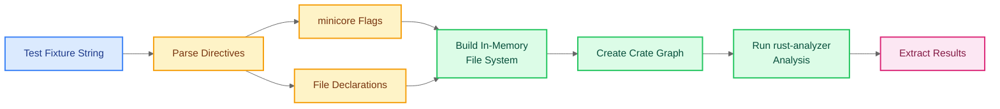
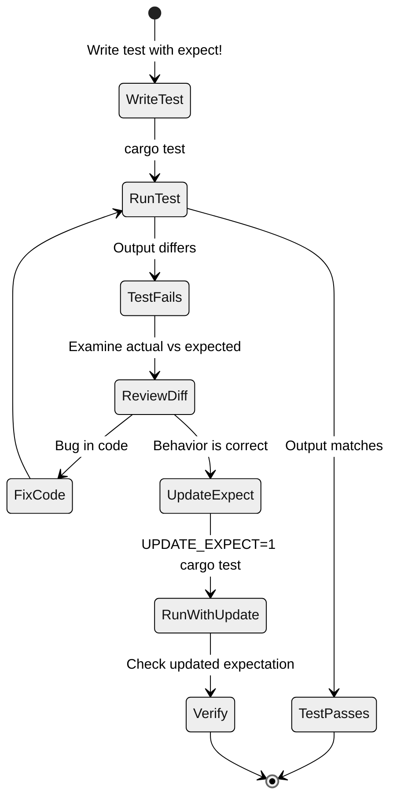

# Testing

Official site: [Link](https://rust-analyzer.github.io/book/contributing/testing.html).

## Test Philosophy

`rust-analyzer` employs **snapshot testing** as its core testing strategy (surprised LOL). The essence: **"A test is a piece of input text, usually Rust code, and some output text."**

The testing helper compares the actual result against the expected output. When tests fail, you can review the diff and either fix the code or update the expectation if the new behavior is correct.

## Test Framework Components

The testing infrastructure combines two main elements:

1. **`expect-test` crate**: A lightweight snapshot testing library that enables automated expectation updates.
2. **Custom testing helpers**: Purpose-built functions for specific `rust-analyzer` features (type inference, diagnostics, etc.).

## Common Test Helpers

### Type Inference Tests

Located in `crates/hir-ty/src/tests`. Three main helper functions:

#### `check_no_mismatches()`

Validates that no type mismatches exist in the given code.

```rust
#[test]
fn simple_assignment() {
    check_no_mismatches(
        r#"
fn main() {
    let x: i32 = 42;
    let y: i32 = x;
}
"#,
    );
}
```

**Note**: This relies on `rust-analyzer`'s analysis, not the Rust compiler. The analyzer might miss errors the compiler would catch, or vice versa.

#### `check_types()`

Asserts specific expression types using inline annotations. Uses `^` markers under code to denote type assertions.

```rust
#[test]
fn type_annotations() {
    check_types(
        r#"
fn main() {
    let x = 1;
     // ^ i32
    let y = "hello";
     // ^ &str
    let z = x + 2;
     // ^ i32
}
"#,
    );
}
```

The `// ^ type` notation marks the expression on the line above and asserts its inferred type.

#### `check_infer()`

Uses `expect-test` to match complete type inference output against expected results. Displays byte ranges, source text, and inferred types for all expressions.

```rust
#[test]
fn infer_function_return() {
    check_infer(
        r#"
fn foo() -> i32 {
    42
}
"#,
        expect![[r#"
        10..11 '{': expected i32, got ()
        15..17 '42': i32
    "#]],
    );
}
```

## Annotation Conventions

`rust-analyzer` tests use a special notation system for marking positions and ranges in code:

| Notation | Purpose | Example |
|:---------|:--------|:--------|
| `$0` | Cursor position (single point) | `let x$0 = 1;` |
| `$0...$0` | Range/selection | `let $0x = 1$0;` |
| `// ^^^^` | Type assertion label | `x + 1`<br>`// ^^^ i32` |

These annotations are processed by the fixture parser and removed before the code is analyzed.

## Fixture System

The fixture system is a mini-language for declaring multi-file, multi-crate test scenarios. It allows tests to simulate complex project structures without requiring actual file system operations.

### Basic Fixture Structure

```rust
#[test]
fn test_cross_crate_reference() {
    check_types(
        r#"
//- minicore: sized
//- /lib.rs crate:foo
pub struct Foo;

//- /bar.rs crate:bar deps:foo
use foo::Foo;
fn use_foo(f: Foo) {
           // ^^^ Foo
}
"#,
    );
}
```

### Fixture Directives

#### Minicore Flags

`//- minicore: flag1, flag2, ...`

Includes specific standard library components. This is the most commonly used directive.

**Common minicore flags:**

| Flag | Provides | When to Use |
|:-----|:---------|:------------|
| `sized` | `Sized` trait | Almost always; recommended when stuck |
| `fn` | `Fn`, `FnMut`, `FnOnce` traits | Required for closures |
| `async_fn` | `AsyncFn*` traits | Required for async closures |
| `iterator` | `Iterator` trait | When testing iteration |
| `option` | `Option<T>` enum | When using `Option` |
| `result` | `Result<T, E>` enum | When using `Result` |
| `unsize` | `Unsize` trait | For unsized types (`dyn Trait`, slices) |
| `coerce_unsized` | `CoerceUnsized` trait | For unsized type coercions |
| `dispatch_from_dyn` | `DispatchFromDyn` trait | For trait object dispatch |

**Important**: If your test mysteriously fails with type errors, try adding `sized` first. Many operations implicitly require the `Sized` trait.

#### File Declarations

`//- /path/to/file.rs crate:name deps:dep1,dep2 edition:2021`

Declares a file in the fixture with optional metadata:

- **Path**: File path relative to project root
- **crate**: Crate name (defaults to file name)
- **deps**: Comma-separated dependency list
- **edition**: Rust edition (defaults to 2021)

```rust
//- /lib.rs crate:mylib
pub mod foo;

//- /foo.rs
pub struct Bar;

//- /main.rs crate:main deps:mylib edition:2021
use mylib::foo::Bar;
```

### Complete Fixture Example

```rust
#[test]
fn test_workspace_with_dependencies() {
    check_types(
        r#"
//- minicore: sized, fn, iterator
//- /workspace/utils/lib.rs crate:utils
pub fn helper() -> i32 { 42 }

//- /workspace/core/lib.rs crate:core deps:utils
use utils::helper;
pub fn process() -> i32 {
    helper()
 // ^^^^^^^^ fn helper() -> i32
}

//- /workspace/app/main.rs crate:app deps:core
use core::process;
fn main() {
    let x = process();
     // ^ i32
}
"#,
    );
}
```

This fixture creates a workspace with three crates (`utils` → `core` → `app`) with proper dependency relationships.

## Fixture System Architecture



The fixture parser:
1. Extracts directives (`minicore`, file paths, metadata).
2. Builds an in-memory file system.
3. Constructs a crate dependency graph.
4. Initializes `rust-analyzer` with this synthetic project.
5. Runs analysis and returns results for assertions.

## UPDATE_EXPECT Workflow

The `expect-test` crate supports automatic expectation updates via the `UPDATE_EXPECT=1` environment variable.

### Manual Update

```bash
UPDATE_EXPECT=1 cargo test
```

This runs all tests and automatically updates any failing `expect![[...]]` blocks with the actual output.

### IDE Integration

Some IDEs (notably VSCode with the `rust-analyzer` extension) provide convenient UI buttons for updating expectations:

- "Update Expect" button in test function hover tooltips
- Inline code actions for specific `expect!` blocks

### Workflow Diagram



## Best Practices

### 1. Import Required Types

The minicore system only includes explicitly requested components. If your test fails with "cannot find type" errors:

```rust
//- minicore: sized, fn, iterator, option  // ← Add missing flags
```

### 2. Start with `sized`

When stuck with mysterious type errors, add `sized` to minicore flags. Many operations implicitly require the `Sized` trait:

```rust
//- minicore: sized  // ← Add this first when debugging
```

### 3. Use Semantic Highlighting for Debugging

If code looks wrong in the test, check its syntax highlighting. Incorrect highlighting often indicates:
- Missing minicore flags
- Syntax errors in the fixture
- Incorrect file path declarations

### 4. Validate with Real IDEs

When test behavior seems suspicious, validate the code in an actual IDE with `rust-analyzer`. Sometimes tests simplify too much and miss real-world edge cases.

### 5. Unsized Types Need Special Flags

Working with `dyn Trait`, slices, or other unsized types? Add these flags:

```rust
//- minicore: sized, unsize, coerce_unsized, dispatch_from_dyn
```

### 6. Keep Tests Minimal

Follow the "Reproduction isolation" principle from `rust-analyzer` conventions: minimize test cases to the smallest code required to reproduce behavior. This reduces noise and debugging time.

## Common Test Patterns

### Testing Completion

```rust
#[test]
fn completes_struct_fields() {
    check_edit(
        "field",
        r#"
struct S { field: i32 }
fn foo(s: S) {
    s.$0
}
"#,
        r#"
struct S { field: i32 }
fn foo(s: S) {
    s.field$0
}
"#,
    );
}
```

The `$0` marker indicates cursor position before (trigger point) and after (expected position) completion.

### Testing Diagnostics

```rust
#[test]
fn detects_type_mismatch() {
    check_diagnostics(
        r#"
fn foo() -> i32 {
    "string"
 // ^^^^^^^^ error: expected i32, found &str
}
"#,
    );
}
```

Inline error annotations specify expected diagnostic messages at specific locations.

### Testing Quick Fixes

```rust
#[test]
fn adds_missing_import() {
    check_fix(
        r#"
//- /lib.rs crate:foo
pub struct Foo;
//- /main.rs crate:main deps:foo
fn main() {
    Foo$0 {};
}
"#,
        r#"
use foo::Foo;

fn main() {
    Foo {};
}
"#,
    );
}
```

Tests that the quick fix correctly adds the missing import.

## Test Organization

`rust-analyzer` organizes tests close to implementation code:

```
crates/
├── hir-ty/
│   └── src/
│       ├── infer.rs              # Type inference logic
│       └── tests/
│           ├── simple.rs         # Basic inference tests
│           ├── traits.rs         # Trait-related tests
│           └── coercion.rs       # Type coercion tests
├── ide/
│   └── src/
│       ├── completion.rs         # Completion implementation
│       └── completion/
│           └── tests.rs          # Completion tests
```

This co-location makes it easy to find relevant tests when modifying code.

## Recap

`rust-analyzer`'s testing philosophy emphasizes:

1. **Data-driven testing**: Tests defined by input/output pairs, resilient to refactoring.
2. **Fixture-based isolation**: Each test builds a complete in-memory project.
3. **Snapshot automation**: `UPDATE_EXPECT=1` eliminates manual expectation maintenance.
4. **Minimal reproduction**: Tests include only what's necessary to trigger behavior.
5. **Co-located tests**: Tests live near implementation for easy discovery.
